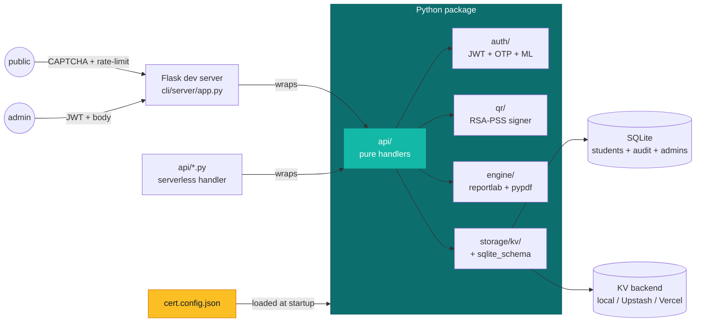
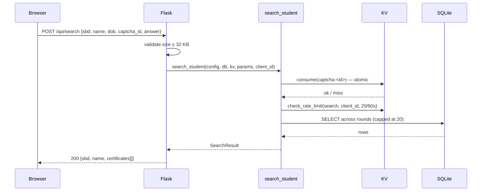
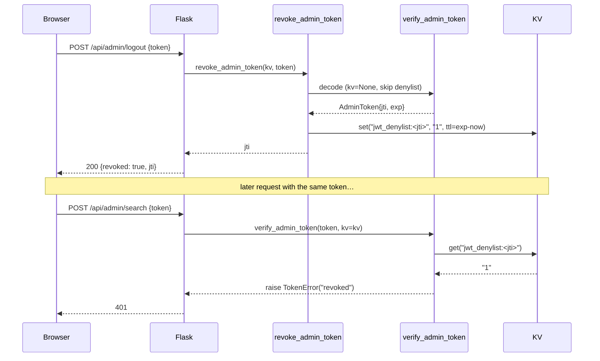
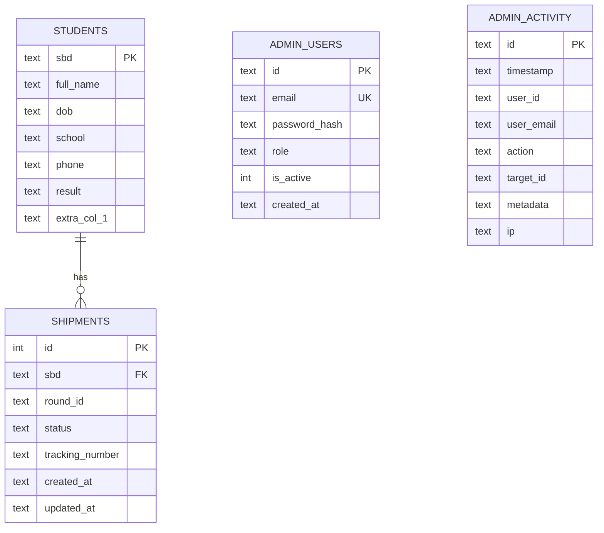

# Architecture

A high-level map of the system so you can predict where to look for a given concern.

## One-diagram view



## Package layout

```text
packages/
├── core/luonvuitoi_cert/
│   ├── api/          # handlers — pure functions, no Flask
│   │   ├── search.py, download.py, verify.py, shipment.py
│   │   ├── admin_update.py, captcha.py
│   │   ├── rate_limiter.py, security.py
│   ├── auth/         # tokens, passwords, OTP, magic link, activity log
│   ├── qr/           # signer + canonical-JSON codec + payload model
│   ├── engine/       # PDF overlay + font registry
│   ├── config/       # Pydantic models + loader
│   ├── storage/kv/   # local / Upstash / Vercel-KV adapters
│   ├── storage/sqlite_schema.py
│   ├── shipment/     # per-round shipment repository
│   ├── ingest/       # CSV / Excel / JSON readers
│   ├── locale/       # en + vi strings
│   ├── ui/           # jinja page renderers
│   └── templates/    # base / index / admin / certificate-checker .html.j2
└── cli/luonvuitoi_cert_cli/
    ├── server/app.py # Flask shim around the api/ handlers
    ├── scaffolds/    # templates for `lvt-cert init`
    └── commands/     # init, seed, gen-keys, dev
```

Everything in `luonvuitoi_cert.api` is a **plain function** that takes config + DB path + KV + params and returns a dataclass. Flask (dev) and the Vercel entrypoint (prod) are thin wrappers. This is the golden rule: **no Flask imports in `luonvuitoi_cert.*`**.

## Request flow — public search



Rate limit comes **after** CAPTCHA on purpose — a user typo shouldn't burn their quota.

## Request flow — admin sign-out + revocation



## Data model



- **One SQLite file per project** — students + admins + audit live together, because the whole point is "config + data dir = entire deployment."
- **Students table name is per-round** (`rounds[].table`), so the config can model "qualifier" vs "finals" as parallel tables with the same schema.
- **No foreign-key enforcement** — config-author is trusted; we validate identifiers at load time.

## KV usage

| Key prefix | Purpose | TTL |
|------------|---------|-----|
| `rl:<scope>:<ip>:<window>` | Rate-limit counters | 2× window_seconds |
| `captcha:<id>` | Pending challenges | 5 min |
| `otp:<email>` | OTP hashes (atomic consume) | 5 min |
| `magic:<hash>` | Magic-link tokens | 15 min |
| `jwt_denylist:<jti>` | Revoked admin sessions (M7) | matches token remaining-life |

All writes either `set(ttl)` or `consume()` — no orphan keys, no cron.

## Design axes

- **Config-driven, not code-driven.** Adding a new project = new `cert.config.json` + template + data. Zero Python.
- **Stateless handlers.** Any handler in `luonvuitoi_cert.api` can be moved behind a different transport (AWS Lambda, Cloud Functions) with a one-line wrapper.
- **KV is the synchronization primitive.** Nothing shares in-process state — workers scale horizontally by sharing KV and SQLite.
- **Fail loud, not silent.** Missing `JWT_SECRET`, unknown config keys, non-HTTPS webhook URLs — every one raises or logs a warning at startup. Production surprises are debt.

## Where to go next

- [Operations](operations.md) — health probe, logs, audit
- [Security](security.md) — user-facing hardening checklist
- [Configuration reference](config-reference.md) — every config key
- [Admin auth](admin-auth.md) — login flows + revocation
- [PDF overlay guide](pdf-overlay-guide.md) — coordinate measurement + fonts
