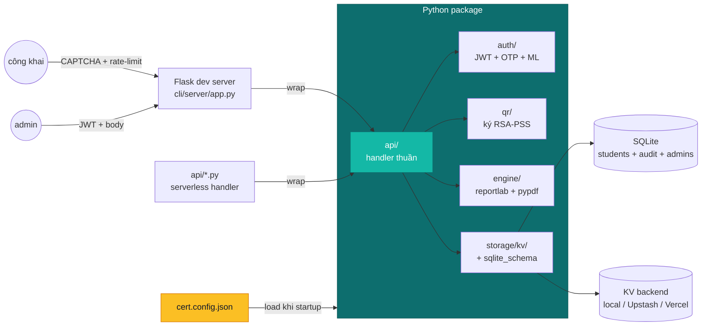
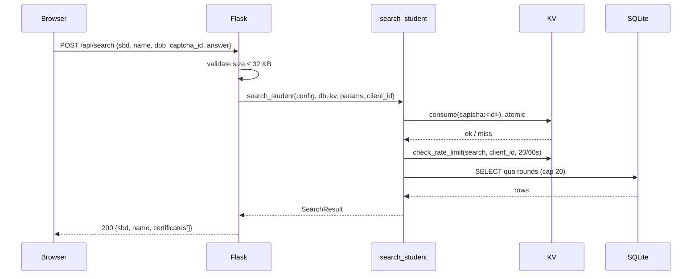
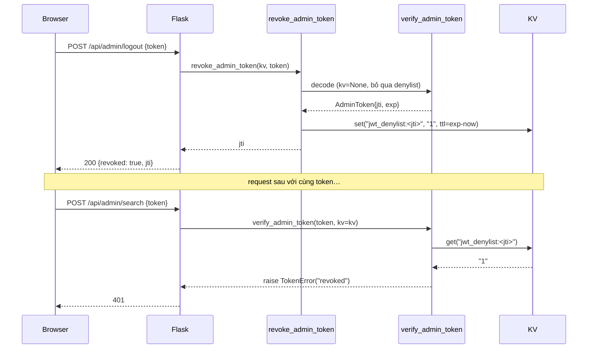
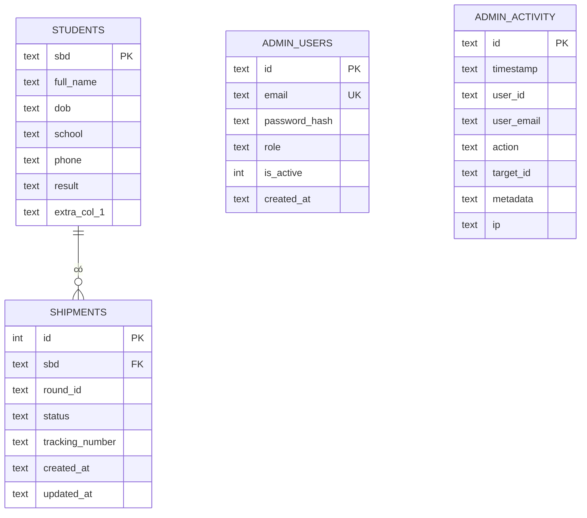

# Kiến trúc

Bản đồ tổng quan của hệ thống, giúp bạn nhanh chóng định vị nên tìm ở đâu khi gặp một vấn đề cụ thể.

## Sơ đồ tổng quan



## Bố cục package

```text
packages/
├── core/luonvuitoi_cert/
│   ├── api/          # handler hàm thuần, không Flask
│   │   ├── search.py, download.py, verify.py, shipment.py
│   │   ├── admin_update.py, captcha.py
│   │   ├── rate_limiter.py, security.py
│   ├── auth/         # tokens, mật khẩu, OTP, magic link, activity log
│   ├── qr/           # bộ ký + codec canonical-JSON + payload model
│   ├── engine/       # PDF overlay + font registry
│   ├── config/       # Pydantic models + loader
│   ├── storage/kv/   # adapter local / Upstash / Vercel-KV
│   ├── storage/sqlite_schema.py
│   ├── shipment/     # repository shipment theo round
│   ├── ingest/       # CSV / Excel / JSON reader
│   ├── locale/       # chuỗi en + vi
│   ├── ui/           # jinja page renderer
│   └── templates/    # base / index / admin / certificate-checker .html.j2
└── cli/luonvuitoi_cert_cli/
    ├── server/app.py # Flask shim quanh các handler api/
    ├── scaffolds/    # template cho `lvt-cert init`
    └── commands/     # init, seed, gen-keys, dev
```

Mọi thứ trong `luonvuitoi_cert.api` đều là **hàm thuần**: nhận config, DB path, KV và params rồi trả về một dataclass. Flask (môi trường dev) và entrypoint Vercel (môi trường production) chỉ là các lớp wrapper mỏng. Đây là quy tắc vàng: **không import Flask trong `luonvuitoi_cert.*`**.

## Flow request: tra cứu công khai



Việc đặt rate limit **sau** CAPTCHA là có chủ đích: một lỗi gõ nhầm của user không nên khiến họ cạn quota.

## Flow request: admin đăng xuất và thu hồi



## Model dữ liệu



- **Một file SQLite cho mỗi project**: students, admins và audit nằm chung một chỗ, vì ý tưởng cốt lõi là "config cộng với data dir là toàn bộ deployment".
- **Bảng students được đặt tên theo từng round** (`rounds[].table`), nhờ đó config có thể mô hình hóa "vòng loại" và "chung kết" thành các bảng song song dùng chung schema.
- **Không ràng buộc khóa ngoại (foreign-key)**: tin tưởng người viết config, đồng thời validate identifier ngay khi load.

## Sử dụng KV

| Key prefix | Mục đích | TTL |
|------------|----------|-----|
| `rl:<scope>:<ip>:<window>` | Counter rate-limit | 2× window_seconds |
| `captcha:<id>` | Challenge pending | 5 phút |
| `otp:<email>` | Hash OTP (consume atomic) | 5 phút |
| `magic:<hash>` | Token magic-link | 15 phút |
| `jwt_denylist:<jti>` | Session admin bị thu hồi (M7) | khớp remaining-life của token |

Mọi lần ghi đều dùng `set(ttl)` hoặc `consume()`, nên không có key bị bỏ rơi (orphan) và không cần cron.

## Trục thiết kế

- **Dựa trên config, không dựa trên code.** Thêm một project mới chỉ gồm: một `cert.config.json` mới, template và data. Không cần viết thêm Python.
- **Handler stateless.** Bất kỳ handler nào trong `luonvuitoi_cert.api` cũng có thể chuyển sang transport khác (AWS Lambda, Cloud Functions) bằng một wrapper một dòng.
- **KV là primitive để đồng bộ.** Không chia sẻ state trong cùng tiến trình; các worker scale ngang bằng cách dùng chung KV và SQLite.
- **Báo lỗi to rõ, không âm thầm.** Thiếu `JWT_SECRET`, gặp key config lạ, hay webhook URL không phải HTTPS: mỗi trường hợp đều raise hoặc log cảnh báo ngay khi startup. Mọi bất ngờ trong production đều là một khoản nợ.

## Đọc tiếp

- [Vận hành](operations.md): health probe, logs, audit
- [Bảo mật](security.md): checklist hardening
- [Tài liệu cấu hình](config-reference.md): mọi key config
- [Xác thực quản trị](admin-auth.md): flow login và thu hồi
- [Hướng dẫn PDF overlay](pdf-overlay-guide.md): đo tọa độ và fonts
