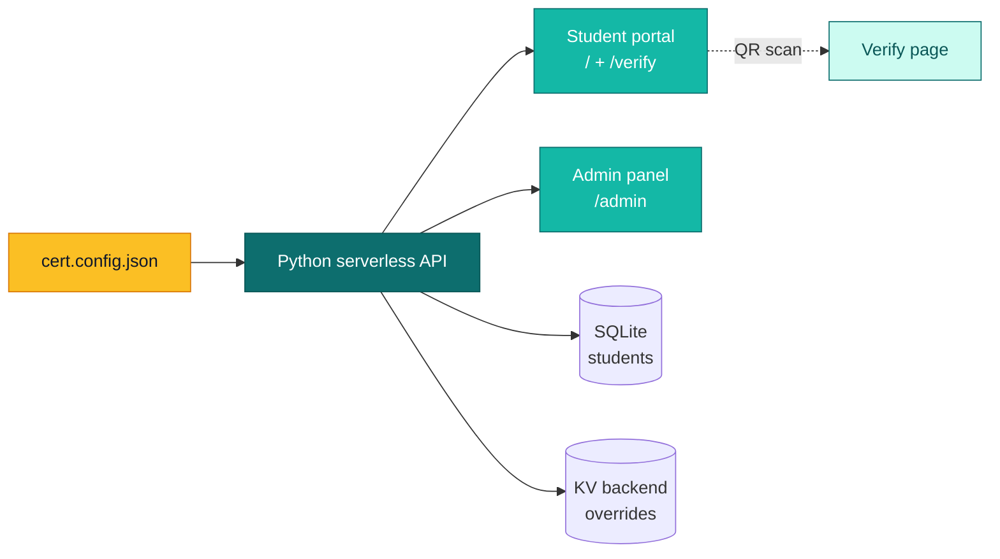

---
hide:
  - navigation
  - toc
---

🧭 Mentor <a href="https://github.com/duongtruongbinh" target="_blank" rel="noopener">@duongtruongbinh</a> &nbsp;·&nbsp; 🤝 Teammate <a href="https://github.com/Liamlenguyen" target="_blank" rel="noopener">@Liamlenguyen</a> — stay tuned for more collabs from <strong>LUONVUITUOI TEAM</strong> ✨ 
📧 <a href="mailto:htkien95@gmail.com">htkien95@gmail.com</a> &nbsp;·&nbsp; 📱 <a href="tel:+84348635408">+84 348 635 408</a>

# LUONVUITUOI-CERT

Config-driven certificate portal toolkit. Bring your PDF template and student list — get a full portal with search, download, admin panel, and QR verification in minutes.

  <a href="quickstart/" class="lvt-btn lvt-btn-primary">🚀 Quickstart (10 min)</a>
  <a href="https://github.com/Kein95/luonvuituoi-cert" class="lvt-btn lvt-btn-ghost" target="_blank" rel="noopener">⭐ View on GitHub</a>

  
  
  
  

## Why this exists

Running a competition, awarding diplomas to a cohort, issuing completion certificates? You typically need a public lookup page, an admin backend, and a verification endpoint — all wired together correctly. **LUONVUITUOI-CERT gives you all three**, deployable to Vercel's free tier or any Docker host, with zero boilerplate.

🎨
### Bring your own template
Drop in a PDF + coordinates file. The engine overlays student names, dates, and QR codes pixel-perfect — no redesign required.

🔍
### Public lookup portal
Recipients search by name or ID, preview their certificate, download signed PDF. Mobile-first, multilingual-ready.

🔐
### Admin panel built in
Manage records, apply corrections, track shipments, audit log. Password-protected with JWT + rate limiting.

📱
### QR verification
Every certificate carries a QR code linking to a public verify page — third parties confirm authenticity in one scan.

⚡
### Deploy anywhere
One-command Vercel deploy (free tier), production Dockerfile, docker-compose — pick your infra.

📦
### Config over code
Single `cert.config.json` drives everything: branding, fields, overlay coords, auth, shipment rules. No forking required.

10min

First deploy

0

Boilerplate code

$0

Vercel free tier

MIT

License

## Architecture

## Next steps

🚀
### [Quickstart →](quickstart.md)
Deploy your first portal in 10 minutes — CLI scaffold, config tour, local run.

🏛️
### [Architecture →](architecture.md)
How the pieces fit — handlers, transport, KV, signing, data model.

⚙️
### [Configuration →](config-reference.md)
Every `cert.config.json` field + environment variable documented.

🔐
### [Security →](security.md)
Hardening checklist for production deploys.

🛠️
### [Operations →](operations.md)
Health probe, log triage, audit trail, incident checklist.

🧭
### [Troubleshooting →](troubleshooting.md)
Common failure modes and their root causes.

