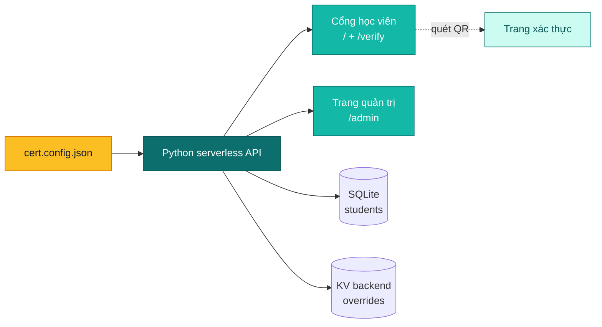

---
hide:
  - navigation
  - toc
---

🤝 Đồng đội <a href="https://github.com/Liamlenguyen" target="_blank" rel="noopener">@Liamlenguyen</a> — hãy đón chờ những bản colab tiếp theo từ <strong>LUONVUITUOI TEAM</strong> ✨ 
📧 <a href="mailto:htkien95@gmail.com">htkien95@gmail.com</a> &nbsp;·&nbsp; 📱 <a href="tel:+84348635408">+84 348 635 408</a>

# LUONVUITUOI-CERT

Bộ công cụ cổng chứng chỉ theo cấu hình. Mang theo file PDF mẫu và danh sách học viên của bạn — nhận ngay một cổng tra cứu, tải về, xác thực QR và trang quản trị chỉ trong vài phút.

  <a href="quickstart/" class="lvt-btn lvt-btn-primary">🚀 Bắt đầu nhanh (10 phút)</a>
  <a href="https://github.com/Kein95/luonvuituoi-cert" class="lvt-btn lvt-btn-ghost" target="_blank" rel="noopener">⭐ Xem trên GitHub</a>

  
  
  
  

## Tại sao cần công cụ này?

Bạn đang tổ chức một cuộc thi, trao chứng chỉ cho học viên, hoặc phát bằng hoàn thành khóa học? Thông thường bạn cần một trang công khai để người nhận tra cứu và tải PDF, một trang quản trị để quản lý dữ liệu, và một trang xác thực để bên thứ ba kiểm tra tính xác thực. **LUONVUITUOI-CERT cung cấp cả ba**, deploy được lên Vercel free tier hoặc bất kỳ Docker host nào, không cần viết code thừa.

🎨
### Dùng template riêng của bạn
Đưa file PDF + tọa độ vào. Engine tự động overlay tên học viên, ngày cấp và mã QR chính xác từng pixel — không cần thiết kế lại.

🔍
### Cổng tra cứu công khai
Người nhận tìm theo tên hoặc số báo danh, xem trước chứng chỉ, tải PDF đã ký. Tối ưu mobile-first, hỗ trợ đa ngôn ngữ.

🔐
### Trang quản trị có sẵn
Quản lý hồ sơ, sửa lỗi, theo dõi vận chuyển, audit log. Bảo vệ bằng JWT + giới hạn tốc độ truy cập.

📱
### Xác thực QR
Mỗi chứng chỉ gắn mã QR dẫn đến trang xác thực công khai — bên thứ ba xác minh chỉ bằng một lần quét.

⚡
### Triển khai bất cứ đâu
Deploy Vercel một lệnh (free tier), Dockerfile production-ready, docker-compose — bạn chọn hạ tầng.

📦
### Cấu hình thay vì code
Một file `cert.config.json` điều khiển mọi thứ: branding, fields, tọa độ overlay, auth, shipment. Không cần fork repo.

10 phút

Deploy lần đầu

0

Code thừa

$0

Vercel free tier

MIT

License

## Kiến trúc

## Bước tiếp theo

🚀
### [Bắt đầu nhanh →](quickstart.md)
Deploy cổng đầu tiên trong 10 phút — CLI scaffold, tour cấu hình, chạy local.

🏛️
### [Kiến trúc →](architecture.md)
Cách các thành phần ghép lại — handlers, transport, KV, ký số, model dữ liệu.

⚙️
### [Cấu hình →](config-reference.md)
Mọi trường `cert.config.json` + biến môi trường đều được tài liệu hóa.

🔐
### [Bảo mật →](security.md)
Checklist hardening cho deploy production.

🛠️
### [Vận hành →](operations.md)
Health probe, triage log, audit trail, checklist ứng cứu sự cố.

🧭
### [Khắc phục sự cố →](troubleshooting.md)
Các lỗi thường gặp và nguyên nhân gốc.

